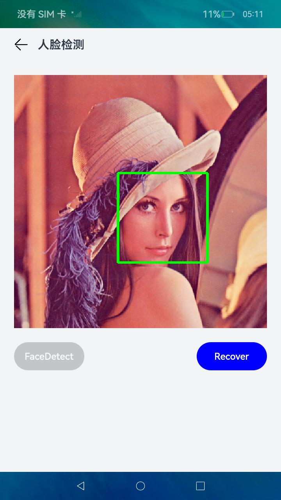
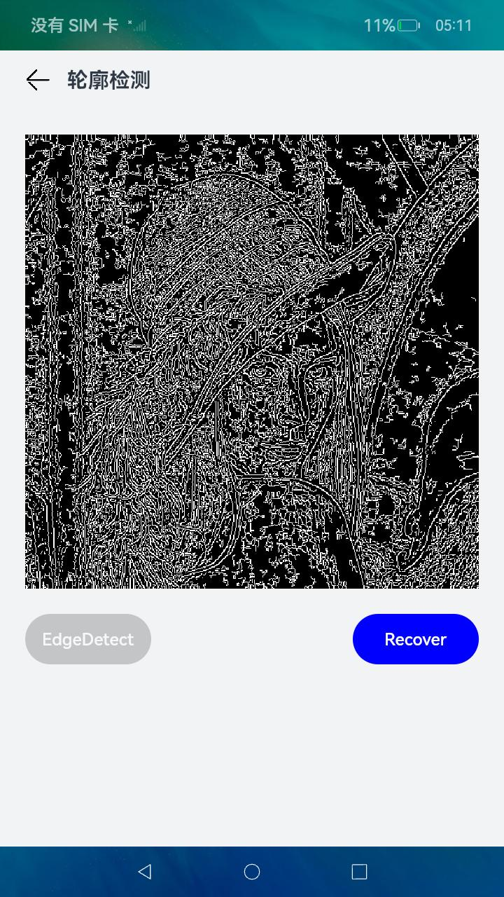
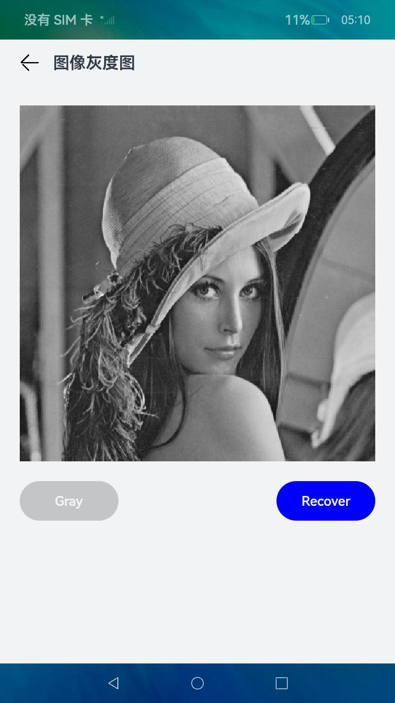

OpenCV
==============

原始仓来源：https://github.com/opencv/opencv/tree/4.5.5

## 仓库说明
本仓库是基于opencv官方仓库4.5.5分支进行了OpenHarmony编译适配和拓展，可构建支持在OpenHarmony设备上运行的计算机视觉程序。

## 构建说明

### 嵌入OHOS中构建

* 构建环境：
1. 目前支持在Linux ubuntu20.4及以上版本随OpenHarmony3.2版本一起用GN编译，也可以用OpenCV自带cmake脚本交叉编译可在OpenHarmony系统调用的动态库;
2. 请确保当前构建环境可以编译OpenHarmony。

* 构建步骤：
1. 构建基础环境：可参照[OpenHarmony官网](https://www.openharmony.cn/download)；

   需要安装的基础软件或库，如果构建环境已安装下面软件可忽略该步骤：
   - git客户端和git-lfs
   - 码云repo工具，安装命令：curl https://gitee.com/oschina/repo/raw/fork_flow/repo-py3 -o /usr/local/bin/repo; chmod a+x /usr/local/bin/repo; pip3 install -i https://repo.huaweicloud.com/repository/pypi/simple reques
   - 执行命令安装OpenHarmony编译依赖的软件：sudo apt-get update && sudo apt-get install binutils git git-lfs gnupg flex bison gperf build-essential zip curl zlib1g-dev gcc-multilib g++-multilib libc6-dev-i386 lib32ncurses5-dev x11proto-core-dev libx11-dev lib32z1-dev ccache libgl1-mesa-dev libxml2-utils xsltproc unzip m4 bc gnutls-bin python3-pip -y
   - 执行如下命令：sudo update-alternatives --install /usr/bin/python python /usr/bin/python3.8 1


2. 下载OpenCV源代码：

   进入OpenHarmony工程的third_party目录下（如没有OpenHarmony源代码，需先下载OpenHarmony源代码），执行如下命令下载OpenCV代码到third_party目录下。
   ```
   git clone https://gitee.com/openharmony-sig/third_party_opencv.git
   mv third_party_opencv opencv
   ```

3. 修改编译白名单文件，增加opencv的编译目标（OpenHarmony4.0及以上版本）：在OpenHarmony源代码的build/compile_standard_whitelist.json文件中，在"deps_added_external_part_module"和"third_deps_bundle_not_add"两个json数组中分别增加以下条目：
	```
	"//third_party/opencv/3rdparty/ade:opencv_ade_source",
	"//third_party/opencv/3rdparty/carotene:opencv_carotene_source",
	"//third_party/opencv/3rdparty/carotene:libtegra_hal",
	"//third_party/opencv/3rdparty/ffmpeg/libavcodec:opencv_ffmpeg_avcodec",
	"//third_party/opencv/3rdparty/ffmpeg/libavcodec:libopencv_avcodec",
	"//third_party/opencv/3rdparty/ffmpeg/libavdevice:opencv_ffmpeg_avdevice",
	"//third_party/opencv/3rdparty/ffmpeg/libavdevice:libopencv_avdevice",
	"//third_party/opencv/3rdparty/ffmpeg/libavfilter:opencv_ffmpeg_avfilter",
	"//third_party/opencv/3rdparty/ffmpeg/libavfilter:libopencv_avfilter",
	"//third_party/opencv/3rdparty/ffmpeg/libavformat:opencv_ffmpeg_avformat",
	"//third_party/opencv/3rdparty/ffmpeg/libavformat:libopencv_avformat",
	"//third_party/opencv/3rdparty/ffmpeg/libswresample:opencv_ffmpeg_swresample",
	"//third_party/opencv/3rdparty/ffmpeg/libswresample:libopencv_swresample",
	"//third_party/opencv/3rdparty/ffmpeg/libswscale:opencv_ffmpeg_swscale",
	"//third_party/opencv/3rdparty/ffmpeg/libswscale:libopencv_swscale",
	"//third_party/opencv/3rdparty/ffmpeg/libavutil:opencv_ffmpeg_avutil",
	"//third_party/opencv/3rdparty/ffmpeg/libavutil:libopencv_avutil",
	"//third_party/opencv/3rdparty/libpng:opencv_libpng_source",
	"//third_party/opencv/3rdparty/libpng:libopencv_png",
	"//third_party/opencv/3rdparty/libtiff:opencv_libtiff_source",
	"//third_party/opencv/3rdparty/libtiff:libopencv_tiff",
	"//third_party/opencv/3rdparty/openjpeg:opencv_openjpeg_source",
	"//third_party/opencv/3rdparty/openjpeg:libopencv_openjpeg",
	"//third_party/opencv/3rdparty/libjpeg-turbo::opencv_libjpeg-turbo_source",
	"//third_party/opencv/3rdparty/libjpeg-turbo:libjpeg-turbo",
	"//third_party/opencv/3rdparty/zlib:libopencv_zlib",
	"//third_party/opencv/3rdparty/zlib:opencv_zlib_source",
	"//third_party/opencv/3rdparty/libwebp:libopencv_webp",
	"//third_party/opencv/3rdparty/libwebp:opencv_libwebp_source",
	"//third_party/opencv/3rdparty/ittnotify:opencv_ittnotify_source",
	"//third_party/opencv/3rdparty/ittnotify:libopencv_ittnotify",
	"//third_party/opencv/3rdparty/quirc:opencv_quirc_source",
	"//third_party/opencv/3rdparty/quirc:libopencv_quirc",
	"//third_party/opencv/modules/calib3d:opencv_calib3d_source",
	"//third_party/opencv/3rdparty/protobuf:opencv_protobuf_source",
	"//third_party/opencv/3rdparty/protobuf:libopencv_protobuf",
	"//third_party/opencv/modules/calib3d:libopencv_calib3d",
	"//third_party/opencv/modules/core:opencv_core_source",
	"//third_party/opencv/modules/core:libopencv_core",
	"//third_party/opencv/modules/dnn:opencv_dnn_source",
	"//third_party/opencv/modules/dnn:libopencv_dnn",
	"//third_party/opencv/modules/features2d:opencv_features2d_source",
	"//third_party/opencv/modules/features2d:libopencv_features2d",
	"//third_party/opencv/modules/flann:opencv_flann_source",
	"//third_party/opencv/modules/flann:libopencv_flann",
	"//third_party/opencv/modules/gapi:opencv_gapi_source",
	"//third_party/opencv/modules/gapi:libopencv_gapi",
	"//third_party/opencv/modules/highgui:opencv_highgui_source",
	"//third_party/opencv/modules/highgui:libopencv_highgui",
	"//third_party/opencv/modules/imgcodecs:opencv_imgcodecs_source",
	"//third_party/opencv/modules/imgcodecs:libopencv_imgcodecs",
	"//third_party/opencv/modules/imgproc:opencv_imgproc_source",
	"//third_party/opencv/modules/imgproc:libopencv_imgproc",
	"//third_party/opencv/modules/ml:opencv_ml_source",
	"//third_party/opencv/modules/ml:libopencv_ml",
	"//third_party/opencv/modules/objdetect:opencv_objdetect_source",
	"//third_party/opencv/modules/objdetect:libopencv_objdetect",
	"//third_party/opencv/modules/photo:opencv_photo_source",
	"//third_party/opencv/modules/photo:libopencv_photo",
	"//third_party/opencv/modules/stitching:opencv_stitching_source",
	"//third_party/opencv/modules/stitching:libopencv_stitching",
	"//third_party/opencv/modules/ts:opencv_ts_source",
	"//third_party/opencv/modules/ts:libopencv_ts",
	"//third_party/opencv/modules/video:opencv_video_source",
	"//third_party/opencv/modules/video:libopencv_video",
	"//third_party/opencv/modules/videoio:opencv_videoio_source",
	"//third_party/opencv/modules/videoio:libopencv_videoio",
	"//third_party/opencv/napi:opencv_napi"
	```

4. 增加子组件opencv：修改文件"productdefine/common/inherit/default.json"，在thirdparty子系统下新增组件opencv。

	```
	{
	  "component": "opencv",
	  "features": []
	}
	```

5. 依赖OpenCV的组件增加opencv依赖：在依赖于opencv的编译目标下增加dep，如果仅仅依赖OpenCV的部分模块，可选择"opencv_image", "opencv_objdetect", "opencv_video"和"opencv_AI"四个中的任意一个作为依赖项，它们分别表示图像基本操作与修复功能集，目标检测类功能集，视频类功能集和AI类功能集。
	```
	deps += [ "//third_party/opencv:opencv" ]
	```
   
6. 编译：在OpenHarmony根目录下，执行如下命令开始编译(注：rk3568是编译出的产品名称，请根据实际编译产品替换)，编译完成后在"out/rk3568/packages/phone/system/lib"可查看编译生成的多个opencv动态so库.
	```
	./build.sh --product-name rk3568 --ccache
	```
### 单独构建
本仓提供shell脚本和交叉编译脚本，用户可以在linux ubuntu环境单独编译OpenCV，编译出的动态so库拷贝到OpenHarmony设备的"/system/lib/"目录下可被其他程序调用。
* 构建环境：
1. cmake 3.12或以上版本
2. git客户端和git-lfs
3. repo
4. wget
5. OpenHarmony full sdk下载链接(OpenHarmony各发布版本README.md文档中提供full sdk下载链接)

* 构建步骤：
1. 下载OpenCV源代码：

   执行如下命令下载OpenCV代码到指定目录下。
   ```
   git clone https://gitee.com/openharmony-sig/third_party_opencv.git
   ```
2. 获取sdk下载地址：
OpenHarmony的每个发布的版本md文件中均提供了sdk的下载路径，如OpenHarmony4.0Release版本的说明链接为[OpenHarmony4.0 Release版本说明](https://gitee.com/openharmony/docs/raw/master/zh-cn/release-notes/OpenHarmony-v4.0-release.md); 进入该链接后在"从镜像站点获取"章节的"表2 获取源码路径"表中找到标准系统Public SDK包的下载站点。
3. 执行构建脚本：
	进入到目录"platforms/ohos", 执行下面命令，开始下载sdk和编译OpenCV, 其中下面命令中的脚本参数"download_url"的值是OpenHarmony4.0 Release版本配套的sdk下载地址，请根据实际版本替换相应sdk下载地址。编译成功后的动态库在"build_ohos/lib/"目录下，可执行文件在"build_ohos/bin/"目录下。
	```sh
	bash build_auto_wget.sh --download_url=https://repo.huaweicloud.com/openharmony/os/4.0-Release/ohos-sdk-windows_linux-public.tar.gz
	```

## 应用示例
  * 应用示例简介
    本应用示例基于Native c++模版构建，实现了人脸检测，轮廓识别，二维码识别，图像灰度图四个简单场景sample。

  * 约束
    安装应用示例之前，请先确认已安装应用开发IDE DevEco Studio3.1 Release及以上版本，并安装了sdk API 9.
	
  * 工程目录
    ```
	entry/src/main
	|-- cpp
	|   |-- CMakeLists.txt                                  // 编译脚本
	|   |-- common
	|   |   |-- common.cpp                                  // 公共函数
	|   |   |-- init.cpp                                    // napi初始化，注册函数
	|   |-- image_basic
	|   |   |-- edgeDetection.cpp                           // 调用轮廓检测native接口
	|   |   |-- faceDetect.cpp                              // 调用人脸检测native接口
	|   |   |-- image2Gray.cpp                              // 调用图像转换为灰度图native接口
	|   |   |-- QRCode_identify.cpp                         // 调用二维码识别native接口
	|   |-- include
	|   |   |-- common.h                                    // 公共函数头文件
	|   |   |-- opencv_napi_api.h                           // native接口头文件
	|   |-- types
	|   |   |-- libohos_opencv_sample
	|   |   |   |-- oh-package.json5
	|   |   |   |-- opencv_sample.d.ts                      // 接口导出
	|-- ets
	|   |-- common
	|   |   |-- AttributeModificationTool.ets               // 属性修改工具组件
	|   |   |-- IntroductionTitle.ets                       // 介绍类标题自定义组件
	|   |   |-- TabContentNavigation.ets                    // 页签内容导航组件
	|   |   |-- TitleBar.ets                                // 页标题自定义组件
	|   |-- data
	|   |   |-- CollectionCategory.ets                      // 页面内容数组
	|   |   |-- ResourceDataHandle.ets                      // 资源类数据转换普通数据类型接口
	|   |-- entryability
	|   |   |-- EntryAbility.ts
	|   |-- model
	|   |   |── CategoricalDataType.ets                     // 页面内容导航数据结构定义
	|   |-- pages
	|   |   |-- image
	|   |   |   |-- basicSample
	|   |   |   |   |-- edgeDetection.ets                   // 轮廓检测页面
	|   |   |   |   |-- faceDetect.ets                      // 人脸检测检测页面
	|   |   |   |   |-- image2Gray.ets                      // 图像转灰度图页面
	|   |   |   |   |-- qrcode.ets                          // 二维码识别页面
	|   |   |   |   |-- qrcode_result_web.ets               // 二维码识别结果网页显示页面
	|   |   |   |-- ImageData.ets                           // 图像页签内容定义
	|   |   |-- Index.ets                                   // 首页
	|   |   |-- machineLearning
	|   |   |   |-- MachineLearningData.ets
	|   |   |-- video
	|   |   |   |-- VideoData.ets
	|   |-- util
	|   |   |-- Logger.ts                                   // hilog封装
	|   |   |-- ShowToast.ets                               // ShowToast封装
	|-- module.json5
	|-- resources
	|   |-- base
	|   |-- en_US
	|   |-- rawfile
	|   |   |-- haarcascade_frontalface_alt.xml             // 人脸检测模型文件
	|   |   |-- lena.jpg                                    // 应用示例使用的图像文件
	|   |   |-- qrcode2.jpg                                 // 应用示例使用的图像文件
	|   |   |-- qrcode.jpg                                  // 应用示例使用的图像文件
	|-- |-- zh_CN
	```

  * 使用方法
  1. 下载：应用示例在本仓的路径"samples/ohos_samples/opencv_app_sample"。先下载本仓完成的代码，然后拷贝文件夹"opencv_app_sample"到windows环境下的应用目录下。
  2. 拷贝opencv源代码到"opencv_app_sample/entry/src/main/cpp"目录下并修改文件夹名称为"opencv"
  3. 将应用示例工程"opencv_app_sample"导入DevEco Studio进行编译构建，安装到OpenHarmony设备上运行调试。

  * 运行效果预览
|首页|人脸检测|轮廓识别|灰度图|二维码识别|
|--------------------------------|--------------------------------|--------------------------------|--------------------------------|--------------------------------|
||||||


